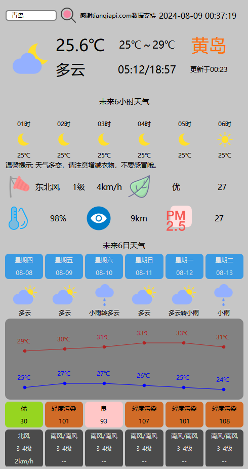
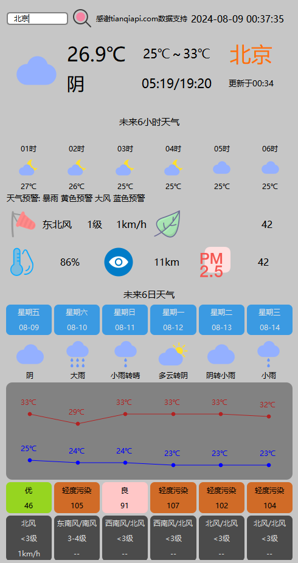
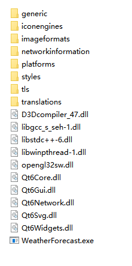

# WeatherForecast
WeatherForecast

## 软件工具

Qt-6.5.2

Qt Creator 14.0.0

MinGW-11.2.0

CMake-3.29.3

C++17

## 主要功能

当日天气：当日日期、所在城市、天气类型、天气图标、当时温度、当日温度范围、日出日落时间、数据更新时间、风向、风力、风速、空气质量等级、空气质量数值、湿度、能见度、PM2.5数值、温馨提示或天气预警。

当日当时未来6小时天气：时间、天气类型图标、温度。

未来6日天气：星期几、日期、天气类型图标、天气类型、最高温度、最低温度、空气质量等级、空气质量数值、风向、风力、风速(仅第一天有)。

查询某国内城市天气：回车或点击搜索按钮即可更新，支持市、县、区等。

## 界面展示

打开默认界面

搜索“北京”界面

## Release目录结构

## 参考

参考教程：https://www.bilibili.com/video/BV1GW42197ff

## 感谢

感谢天气AIP网站提供天气数据: http://tianqiapi.com/

# End

